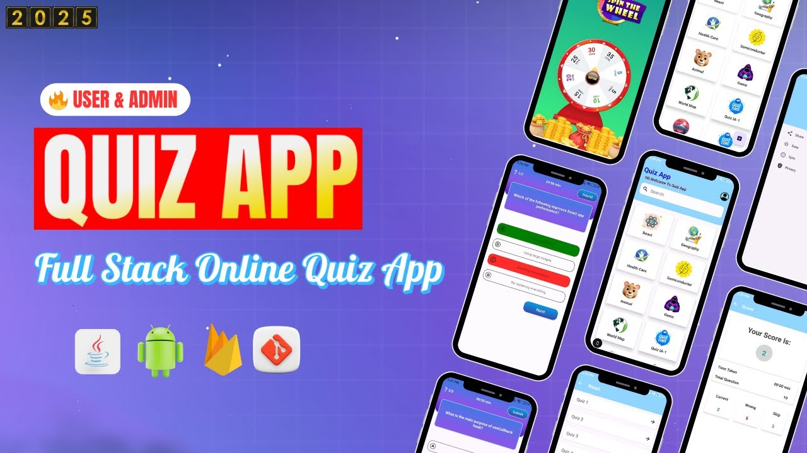

# 🧠 Online Quiz App (User + Admin)

A full-featured Online Quiz Android application built using **Java, XML, MVVM, and Firebase**.

This project includes both **User and Admin applications**, real-time question management, timer-based quizzes, and a spin-to-win reward system for enhanced user engagement.

------------------------------------------------------------

------------------------------------------------------------

Perfect for:
• Resume projects  
• Final year college submissions  
• Hackathons  
• Android portfolio  

------------------------------------------------------------

## 🚀 Features

### 👤 User App

✔ Attempt quizzes with timer functionality  
✔ Category-based quiz selection  
✔ Real-time score calculation  
✔ Spin-to-Win reward feature  
✔ View results after quiz completion  
✔ Secure logout  

------------------------------------------------------------

### 🛠 Admin App

✔ Add new quiz categories  
✔ Add / edit / delete quiz questions  
✔ Set quiz timer duration  
✔ Manage user scores  
✔ Monitor quiz activity in real-time  

------------------------------------------------------------

## 🏗 Architecture

• MVVM Architecture  
• Repository Pattern  
• Firestore  
• ViewModel + LiveData  
• Clean modular structure  
• Scalable Android project design  

------------------------------------------------------------

## 🛠 Tech Stack

• Java  
• XML  
• Android Studio  
• Firebase Firestore  
• Firebase Storage  

------------------------------------------------------------

## 📂 Project Structure

OnlineQuizApp/
│
├── data/
├── ui/
├── viewmodel/
├── repository/
├── admin/
└── utils/

------------------------------------------------------------

## ⏳ Quiz System

• Timer-based question flow  
• Automatic next question handling  
• Real-time result calculation  
• Score tracking  

------------------------------------------------------------

## 🎯 Engagement Feature

• Spin-to-Win reward system  
• Gamified user interaction  
• Increased retention strategy  

------------------------------------------------------------

## 🧪 How to Run
```bash
1. Clone this repository  
2. Open in Android Studio  
3. Connect Firebase project  
4. Add google-services.json  
5. Sync Gradle  
6. Run on emulator or physical device  
```
------------------------------------------------------------

## 📌 Learning Outcomes

By building this project, you will learn:

• Android app development using Java  
• MVVM architecture implementation  
• Firebase integration  
• Admin + user app architecture  
• Gamification concepts in mobile apps  

------------------------------------------------------------

## 🤝 Contributing

Contributions are welcome to improve features and performance.

---

## ⭐ Support

If you found this project helpful, please give it a star ⭐

------------------------------------------------------------
